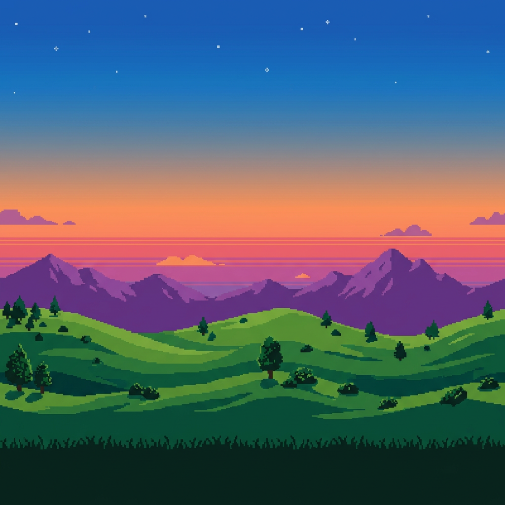

# 🏔️ Touch Bar Landscape

A macOS application that displays an **infinite scrolling pixel art landscape** exclusively on your MacBook Pro Touch Bar. The app runs as a background utility with no Dock icon, focusing entirely on the Touch Bar aesthetic.



## ✨ Features

- **Infinite scrolling** pixel art landscape on the Touch Bar
- **60fps smooth animation** using SpriteKit's `update(_:)` loop
- **Seamless tiling** — two sprite nodes wrap around endlessly
- **Lightweight** — runs as `LSUIElement` (no Dock icon, no menu bar)
- **Delta-time based** movement for consistent scroll speed

## 🛠️ Requirements

- **macOS 10.15+** (Catalina or later)
- **Intel MacBook Pro with Touch Bar** (2016–2020 models)
- **Xcode 15+** with Swift 5

> **Note:** Apple Silicon Macs without a Touch Bar will not display the landscape. You can test using Xcode's Touch Bar Simulator (Window → Show Touch Bar).

## 🚀 Setup Instructions

### Option 1: Open in Xcode (Recommended)

1. **Open the project:**
   ```bash
   cd TouchBarLandscape
   open TouchBarLandscape.xcodeproj
   ```

2. **Select your signing team** (if prompted):
   - Click on the project in the navigator
   - Go to **Signing & Capabilities**
   - Select your Apple ID / development team

3. **Build and Run** (⌘R):
   - The app will launch with no visible window
   - Look at your Touch Bar — you should see the scrolling landscape!

4. **To quit:** Right-click the app in Activity Monitor → Quit, or use the menu bar if visible.

### Option 2: Build from Terminal

```bash
cd TouchBarLandscape

# Build the project
xcodebuild -project TouchBarLandscape.xcodeproj \
  -scheme TouchBarLandscape \
  -configuration Debug \
  build

# Run the built app
open ~/Library/Developer/Xcode/DerivedData/TouchBarLandscape-*/Build/Products/Debug/TouchBarLandscape.app
```

## 🖼️ Replacing the Pixel Art

To use your own landscape image:

1. Create a seamless/tileable pixel art image (any width, ~60px tall works best)
2. Replace the file at:
   ```
   TouchBarLandscape/Assets.xcassets/landscape.imageset/landscape.png
   ```
3. Rebuild and run

**Tips for custom art:**
- Keep it **horizontally seamless** — left edge must match right edge
- Height of **60px** maps to the Touch Bar's 30pt (2x Retina)
- Use `filteringMode = .nearest` (already set) to preserve crisp pixels

## ⚙️ Configuration

In `LandscapeScene.swift`, you can adjust:

```swift
/// Scroll speed in points per second
private let scrollSpeed: CGFloat = 50.0
```

- **Lower values** (20–30) = slow, dreamy scroll
- **Higher values** (80–100) = fast, energetic scroll

## 📁 Project Structure

```
TouchBarLandscape/
├── TouchBarLandscape.xcodeproj/
│   └── project.pbxproj
├── TouchBarLandscape/
│   ├── AppDelegate.swift          # App entry — minimal hidden window
│   ├── LandscapeScene.swift       # SKScene — infinite scroll logic
│   ├── TouchBarController.swift   # NSWindowController — Touch Bar provider
│   ├── Info.plist                  # LSUIElement=true (no Dock icon)
│   └── Assets.xcassets/
│       ├── AppIcon.appiconset/
│       └── landscape.imageset/
│           └── landscape.png      # Pixel art asset
└── README.md
```

## 🔧 Git Setup

To initialize a Git repository and track your changes:

```bash
cd TouchBarLandscape

# Initialize repo
git init

# Create .gitignore for Xcode projects
cat > .gitignore << 'EOF'
# Xcode
build/
DerivedData/
*.xcuserdata/
*.xcworkspace/xcuserdata/
*.xcodeproj/xcuserdata/
*.xcodeproj/project.xcworkspace/xcshareddata/IDEWorkspaceChecks.plist

# macOS
.DS_Store
*.swp
*~
EOF

# Initial commit
git add .
git commit -m "Initial commit: Touch Bar pixel art landscape app"
```

## 📝 How It Works

1. **AppDelegate** creates a tiny off-screen window and attaches a `LandscapeWindowController`
2. **LandscapeWindowController** (`NSWindowController` subclass) overrides `makeTouchBar()` to create an `NSTouchBar` with a single `NSCustomTouchBarItem`
3. The item contains an **SKView** presenting a **LandscapeScene**
4. **LandscapeScene** creates two identical `SKSpriteNode`s placed side-by-side
5. Each frame, both nodes move left by `scrollSpeed × deltaTime` points
6. When a node exits the left edge, it wraps to the right of the other node
7. This creates an **infinite, seamless scrolling effect** ♾️

## License

MIT — feel free to customize and share!
